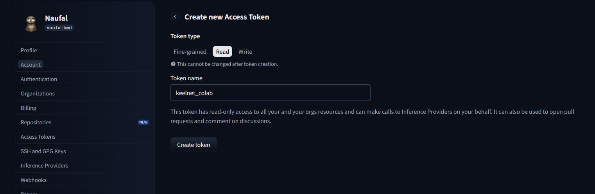
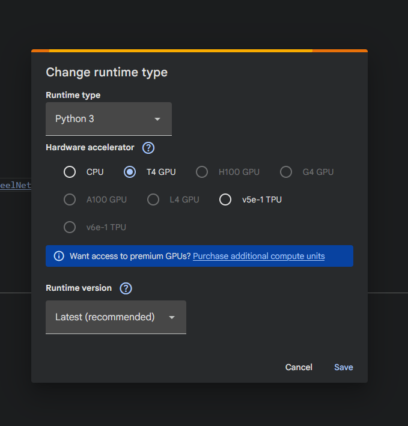
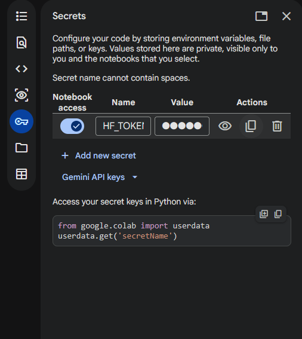

# KeelNet Experiment Guidelines

Use this guide to set up the official team workflow:

1. open the notebook in browser Google Colab from the correct GitHub branch
2. run the notebook in Colab
3. edit code locally in VS Code when needed
4. commit and push changes to GitHub
5. rerun the setup cell in Colab
6. repeat until the stage succeeds

Before the first notebook run, do the key and Hugging Face setup in this order:

1. make a Hugging Face token
2. open the notebook in browser Google Colab
3. add the token to Colab Secrets as `HF_TOKEN`
4. then run the setup cell

Also read:

- [`stages/01-grounded-abstention-baseline/README.md`](../stages/01-grounded-abstention-baseline/README.md)
- [`stages/01-grounded-abstention-baseline/results-template.md`](../stages/01-grounded-abstention-baseline/results-template.md)

## 1. Install The Required Tools

Install:

- VS Code `Python` extension
- VS Code `Pylance` extension
- VS Code `Jupyter` extension
- Git

## 2. Create The Required Accounts

Each teammate needs:

- GitHub account
- Google account with Drive access
- Hugging Face account

## 3. Make A Hugging Face Token

1. Sign in at `https://huggingface.co/`.
2. Open Settings.
3. Open Access Tokens.
4. Create a new token.
5. Use a clear name such as `keelnet-colab`.
6. Choose a `Read` token.
7. Copy the token value right away.



If Hugging Face shows the fine-grained token screen instead, keep it read-only and do not enable write or admin-style permissions.

## 4. Open The Notebook In Colab

Open it in browser Google Colab like this:

1. open `https://colab.google.com/`
2. click `GitHub`
3. choose `naufalkmd/KeelNet`
4. switch to the branch you want to run
5. open `stages/01-grounded-abstention-baseline/notebooks/google-colab.ipynb`
6. make sure the runtime uses GPU
7. do not run the setup cell yet if `HF_TOKEN` is not in Colab Secrets

Important:

- use browser Colab for executing this notebook
- use VS Code for editing code between notebook runs
- this notebook depends on `google.colab`, Drive mount, and Colab Secrets



## 5. Put The Token In Google Colab

1. Open the Stage 1 notebook in browser Google Colab.
2. Open the left sidebar in Colab.
3. Click the key icon for `Secrets`.
4. Add a new secret named `HF_TOKEN`.
5. Paste your Hugging Face token as the value.
6. Rerun the notebook setup cell.

What you should see after rerunning the setup cell:

- `Loaded HF_TOKEN from Colab secrets.`



If you do not see the key icon, you are probably not in a real Colab runtime yet.

## 6. Prepare Local Editing

Clone the repo locally and switch to the correct branch:

```bash
git clone git@github.com:naufalkmd/KeelNet.git
cd KeelNet
git checkout stage/01-grounded-abstention-baseline
git checkout -b yourname/stage1-work
```

## 7. Set Up Drive

Use this Drive path:

- `/content/drive/MyDrive/KeelNet`

Share the `KeelNet` folder in your Google Drive with your teammates so they can see the saved artifacts.

The notebook saves outputs under:

- `DRIVE_PROJECT_DIR / artifacts / stage1_colab / RUN_NAME`

Use a unique `RUN_NAME` so teammates do not overwrite each other.

Example:

- `naufal-stage1-20260325-a`

## 8. Understand The Three Places

Do not mix these up:

1. local VS Code repo: where you edit
2. `/content/KeelNet`: the Colab execution copy
3. `/content/drive/MyDrive/KeelNet`: the shared artifact folder

Important:

- local file edits do not automatically update `/content/KeelNet`
- Drive is for artifacts, not the repo

## 9. Use This Repeat Loop

Use this same loop during the whole stage:

1. open the notebook in browser Colab from the correct GitHub branch
2. run the setup cell
3. run the config cell
4. run the test cell
5. if something needs to change, edit the code locally in VS Code
6. commit your changes locally
7. push your branch to GitHub
8. rerun the setup cell in Colab so `/content/KeelNet` updates
9. rerun the cells you need
10. repeat until the stage succeeds

If you skip step 8, Colab may still run old code.

## 10. Run The Notebook In This Order

For Stage 1, run:

1. setup cell
2. config cell
3. test cell
4. train `baseline`
5. train `abstain`
6. evaluate both
7. compare the results

Before a full run, do a smoke test with smaller:

- `MAX_TRAIN_SAMPLES`
- `MAX_EVAL_SAMPLES`

## 11. Check These Values Before Training

After the config cell, confirm:

1. `Repo dir` is `/content/KeelNet`
2. `Artifacts root` points to your Drive folder
3. `Run output dir` points to your unique run folder
4. `CUDA available: True` for full runs

## 12. Save And Report Results

For each completed run, record:

1. branch name
2. run name
3. what changed
4. main metrics
5. where the artifacts were saved

For Stage 1, fill in:

- [`stages/01-grounded-abstention-baseline/results-template.md`](../stages/01-grounded-abstention-baseline/results-template.md)

## 13. Quick Troubleshooting

If something fails, check:

1. did you push your latest code?
2. did you rerun the setup cell after pushing?
3. is `DRIVE_PROJECT_DIR` correct?
4. is `RUN_NAME` unique?
5. is the runtime on GPU?
6. is `HF_TOKEN` loaded?

## 14. One-Line Summary

Open the notebook in browser Colab from the correct GitHub branch, run it there, edit code in VS Code, push changes, rerun the setup cell, and repeat.
