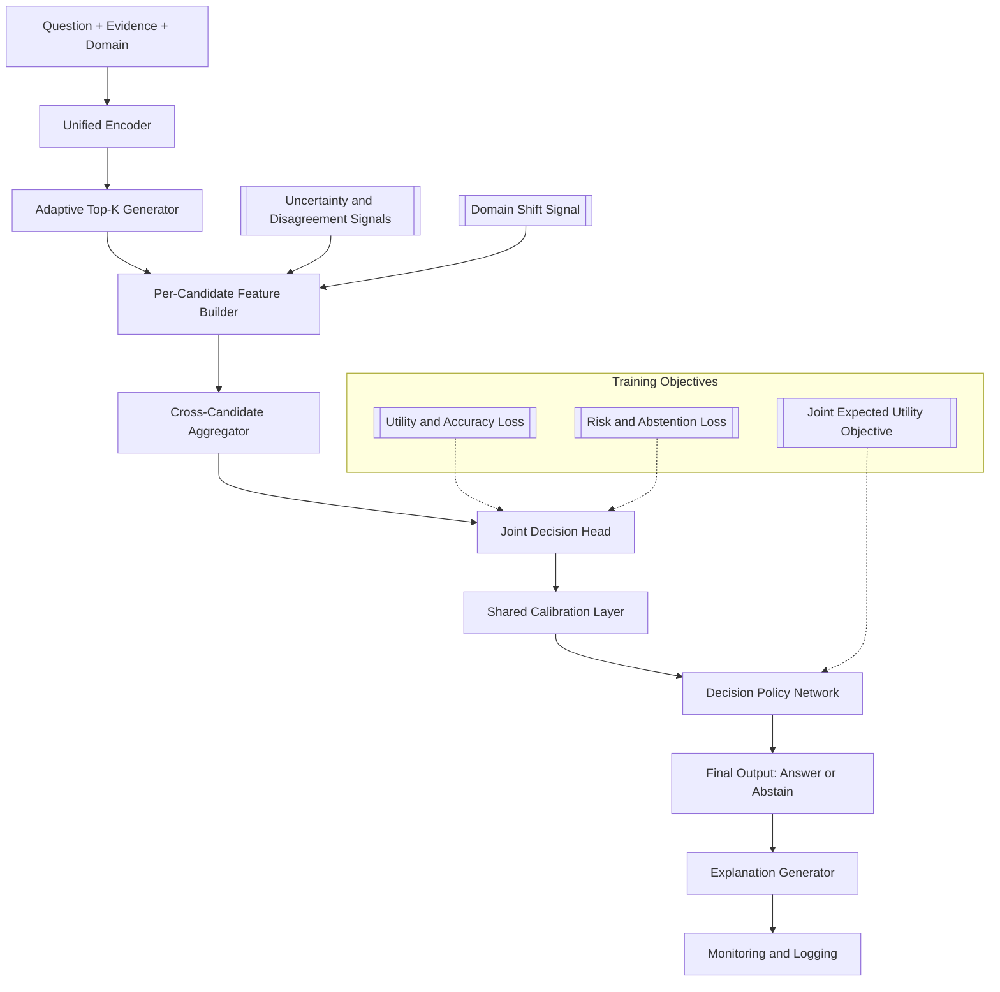
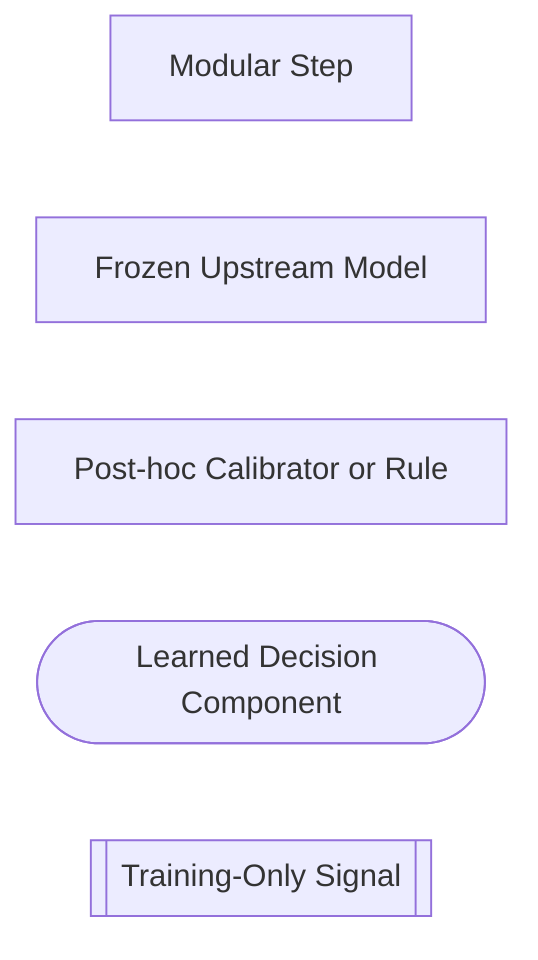
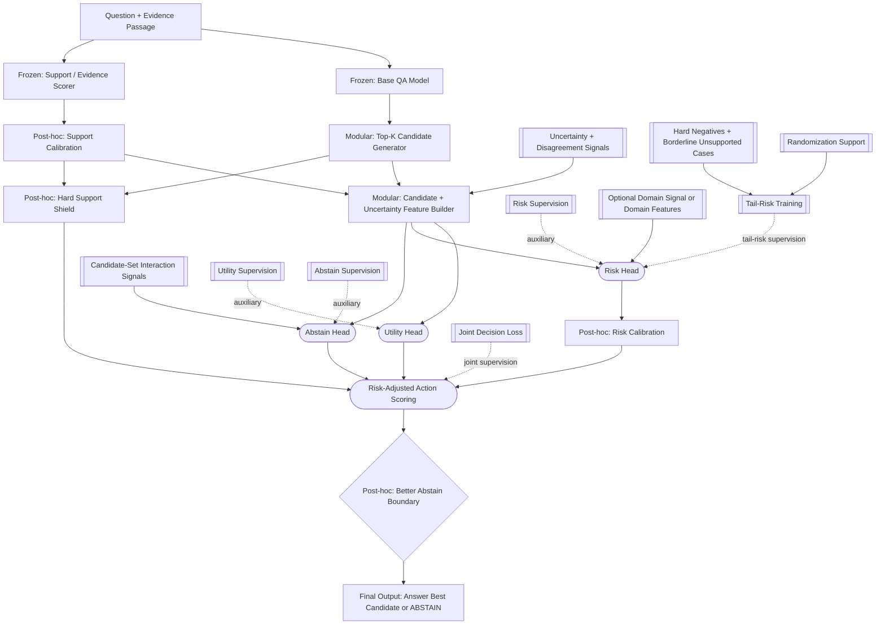
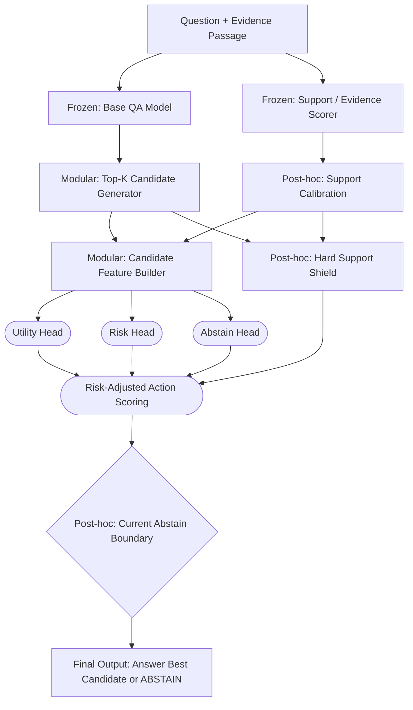
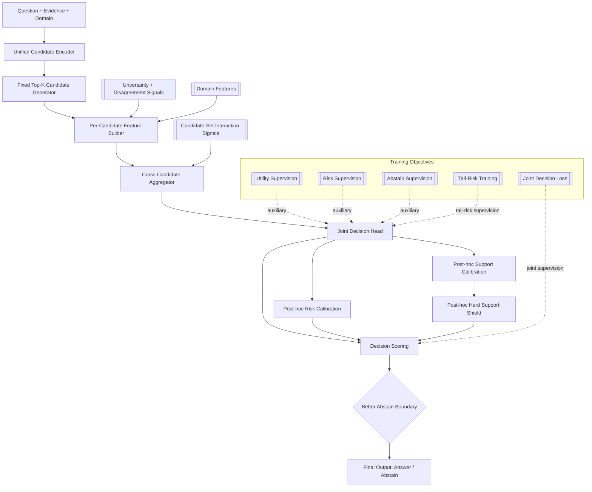

# Stage 9: Risk Generalization And Tail-Risk Control

Stage 9 should keep the Stage 8.2 decision structure and strengthen the part
that is still failing: the learned risk signal does not transfer tightly enough
from validation to held-out data.

This is not a new search-heavy architecture.
It is a harder, more stable version of the current learned action layer.

## Goal

Build a stronger Stage 8.2-style action learner whose calibrated risk signal
separates supported from unsupported answers well enough to preserve the
unsupported-answer budget on held-out data without collapsing answerable
utility.

## What Stays Fixed

- base QA model as the proposal network
- top-K candidate generation
- support or evidence scorer
- learned utility head
- learned risk head
- explicit abstain action
- calibrated support signal as an input feature or safety shield

## What Changes In Stage 9

- make the risk head more tail-risk-aware and more domain-sensitive
- strengthen joint decision training so the heads optimize toward the final
  answer-versus-abstain decision, not only separate local scores
- enrich the candidate representation with stronger uncertainty and disagreement
  features rather than adding a separate uncertainty module
- strengthen the abstain path with richer whole-candidate-set signals
- calibrate the risk head itself, not only QA confidence and support confidence
- train harder on borderline unsafe answered cases
- make the abstain boundary depend on calibrated risk transfer, not only a
  validation-time raw threshold
- reduce reliance on post-hoc rules only when the learned risk signal becomes
  strong enough to absorb that behavior safely

## Architecture

### DeepSeek-Safe Version



### Legend



- `Frozen`: a learned model whose weights are kept fixed during Stage 9.
- `Modular`: a separate pipeline block outside the learned action layer.
- `Post-hoc`: a calibration, filter, or rule applied after model scores are produced.

### Stage 9 Target



### Stage 8.2 Current Learned Baseline



Rectangle nodes are the non-learned pipeline pieces.
Their labels tell you whether they are `Modular:`, `Frozen:`, or `Post-hoc:`.
Rounded nodes are learned decision components.
Double-bracket nodes are training-time or auxiliary inputs rather than the
main deployed decision path.

### Brief Box Guide

- `Question + Evidence Passage`: the input question and the provided evidence
  context.
- `Frozen: Base QA Model`: the upstream QA backbone reused as a fixed proposal
  model rather than retrained inside Stage 9.
- `Modular: Top-K Candidate Generator`: turns the QA outputs into a bounded set
  of candidate answers.
- `Frozen: Support / Evidence Scorer`: estimates how well each candidate is
  supported by the evidence.
- `Modular: Candidate + Uncertainty Feature Builder`: assembles the
  candidate-level signals used by the action learner, including uncertainty,
  disagreement, and margin-style features.
- `Post-hoc: Support Calibration`: remaps raw support scores into more reliable
  calibrated support probabilities.
- `Utility Head`: predicts how useful it would be to answer with a candidate.
- `Risk Head`: predicts how likely an answered candidate is to be unsupported.
- `Abstain Head`: predicts the learned score for choosing `ABSTAIN`.
- `Uncertainty + Disagreement Signals`: extra signals such as entropy, score
  margin, support-versus-keep disagreement, or top-candidate ambiguity.
- `Candidate-Set Interaction Signals`: whole-set cues that help the abstain
  path see ambiguity or conflict across the candidate set rather than only local
  candidate scores.
- `Hard Negatives + Borderline Unsupported Cases`: difficult unsafe examples
  mined to teach the risk head where the dangerous boundary is.
- `Tail-Risk Training`: training pressure that emphasizes the costly answered
  mistakes the system most needs to avoid.
- `Randomization Support`: optional stochastic support used for robustness,
  regularization, or negative refresh without becoming part of the deployed
  answer path.
- `Utility Supervision`: auxiliary training signal that keeps the utility head
  useful as a candidate-quality estimator.
- `Risk Supervision`: auxiliary training signal that keeps the risk head tied
  to unsupported-answer prediction.
- `Abstain Supervision`: auxiliary training signal that keeps the abstain head
  tied to the answer-versus-abstain target.
- `Joint Decision Loss`: training pressure on the final action behavior so the
  utility, risk, and abstain signals align better with the actual decision
  objective.
- `Optional Domain Signal or Domain Features`: extra cues that help the risk
  head adapt if the data mix changes across domains or settings.
- `Post-hoc: Risk Calibration`: remaps raw risk scores into calibrated
  unsupported-answer probabilities.
- `Risk-Adjusted Action Scoring`: combines utility, risk, and abstain signals
  into one action score.
- `Post-hoc: Hard Support Shield`: blocks candidates that fall below the
  minimum acceptable support level.
- `Post-hoc: Better Abstain Boundary`: the final rule that decides whether the
  best candidate is strong enough to beat abstention safely.
- `Post-hoc: Current Abstain Boundary`: the current Stage 8.2 final answer
  versus abstain rule before the Stage 9 hardening changes.
- `Final Output: Answer Best Candidate or ABSTAIN`: the final system decision.

### Where Randomization Can Support

Randomization should support Stage 9 as a training or robustness tool, not as a
core deployed decision box.

- It can support `Tail-Risk Training` through hard-negative refresh, stochastic
  sampling of borderline cases, and dropout-style regularization.
- It can support robustness evaluation through multi-seed runs and stability
  checks across the same protocol.
- It can support uncertainty ablations such as ensembling or MC-dropout, but
  those should stay optional unless they clearly improve held-out risk control.

Stage 8.2 is the current learned baseline under the same candidate-action
formulation, but it does not yet add the main Stage 9 hardening changes:

- explicit harder tail-risk training
- richer uncertainty and candidate-set interaction signals
- stronger joint decision-aware training
- post-hoc calibration of the learned risk head
- a more conservative abstain boundary based on calibrated risk plus a safety margin

## How To Do Each New Part

### 1. Stronger Risk Head And Uncertainty Features

The Stage 9 risk head should predict:

`P(candidate is unsupported | candidate is answered)`

That is narrower and more useful than predicting a generic error score.

Practical changes:

- feed the risk head candidate-level support features, disagreement features,
  rank features, abstain features, and lexical overlap features
- add features that expose uncertainty shape, not just confidence magnitude
- add optional domain features if the setting mixes domains
- keep the final action space the same: `{candidate_1 ... candidate_k, abstain}`

Good feature additions still inside scope:

- support-versus-keep disagreement
- margin between top candidates
- entropy across candidate action scores
- abstain-versus-best-answer gap
- answer length and span shape
- question type or answer type cues
- passage-position or evidence-density cues
- optional domain id embedding if multiple domains are present

These are not a totally new module.
They are a stronger version of the uncertainty-style features that Stage 8.2
already began to use.

### 2. Risk Calibration

The current system calibrates QA and support signals.
Stage 9 should also calibrate the learned risk head after training.

This should be treated as a support mechanism, not as the whole answer.
If the learned risk head gets stronger, Stage 9 should test whether lighter
post-hoc correction is enough.

Practical recipe:

1. train the Stage 8.2-style model normally
2. collect raw risk-head probabilities on a held-out calibration split
3. fit a calibration map for unsupported-answer probability
4. use the calibrated risk, not the raw risk, for threshold selection and final
   abstain decisions

Candidate calibration methods:

- temperature scaling if the risk logit is reasonably monotonic
- Platt scaling for a simple sigmoid remap
- isotonic regression if the score is monotonic but badly shaped

What to measure:

- risk ECE
- Brier score for unsupported-answer prediction
- reliability by risk bin
- transfer gap between validation-selected and held-out unsupported-answer rate

### 3. Harder Tail-Risk Training

The model needs more pressure on the rare cases that matter most:
confident answered negatives that should have been abstentions.

Practical recipe:

- mine false supported answers from Stage 5, Stage 7, and Stage 8.2 outputs
- oversample borderline unsupported examples
- upweight high-confidence unsupported answered cases
- keep ordinary examples in training so the system does not become a pure
  refusal model

Useful negative types:

- answer spans with strong QA score but weak or contradictory evidence support
- near-miss spans that look plausible but are not grounded
- examples where support and QA disagree sharply
- examples that passed validation-time thresholds but fail on held-out data

Loss ideas still inside scope:

- focal weighting on unsupported answered negatives
- top-risk batch weighting
- explicit tail-risk loss on the highest-risk wrong answers
- moderate over-abstention penalty so the fix does not just reduce answer rate

### 4. Joint Decision-Aware Training

Stage 9 should train the learned layer more directly for the final
answer-versus-abstain decision, not only for separate head quality.

Practical recipe:

- keep the action-space cross-entropy as the anchor loss
- keep utility and risk supervision, but make them support the final decision
  objective rather than drifting into disconnected local targets
- include tail-risk pressure on the dangerous answered mistakes
- monitor whether the learned decision improves the actual deployed metrics,
  not only head-local losses

What this means in practice:

- better agreement between `utility`, `risk`, and `abstain` during training
- less reliance on post-hoc rule stacking to recover safe behavior
- clearer ablations when a learned change truly improves the operating frontier

### 5. Better Abstain Boundary

The abstain action should stay explicit, but the boundary should become more
stable across splits.

Do this by making abstention depend on calibrated, transferable signals rather
than one raw learned score alone.

The abstain path should also remain group-aware:
it should use whole-candidate-set cues such as top-1 versus top-2 gap,
candidate disagreement, support spread, and other ambiguity signals.

A practical Stage 9 boundary can be:

1. remove candidates below the calibrated support floor
2. remove candidates above the calibrated risk ceiling
3. score the survivors with `utility - lambda_u * calibrated_risk`
4. compare the best surviving answer against the abstain logit
5. abstain unless the best answer beats abstain by a safety margin

That last margin matters.
It prevents the system from answering when the best candidate only barely wins.

A simple decision rule is:

```text
answer if:
  support_calibrated >= tau_support
  risk_calibrated <= tau_risk
  score_best >= score_abstain + delta

otherwise:
  ABSTAIN
```

This is still inside scope because it does not replace the action learner.
It just makes the final boundary more conservative and more transferable while
keeping the learned action layer central.

## Training And Inference View

### Training

- freeze or reuse the current QA proposal engine
- train the action learner on candidate sets
- enrich the risk head and abstain path with stronger uncertainty and
  candidate-set interaction features
- keep joint decision-aware loss on the final action behavior
- mine and oversample tail-risk negatives
- fit a post-hoc risk calibrator on held-out predictions

### Inference

- generate top-K candidates
- score support
- calibrate support
- predict utility, risk, and abstain logits
- calibrate risk
- compare the best surviving answer against abstain with a safety margin
- apply support and risk shields
- compare best answer against abstain with a safety margin

## What Is New Versus Already Applied

| Component               | Already in Stage 8.2                   | New in Stage 9                                                                               |
| ----------------------- | -------------------------------------- | -------------------------------------------------------------------------------------------- |
| Base QA model           | yes                                    | keep fixed unless ablations justify changes                                                  |
| Top-K candidates        | yes                                    | keep fixed                                                                                   |
| Support scorer          | yes                                    | reuse, possibly add richer candidate-level features                                          |
| Candidate features      | partial uncertainty cues already exist | add stronger uncertainty, disagreement, and candidate-set interaction signals                |
| Risk head               | yes                                    | strengthen for tail-risk separation and optional domain sensitivity                          |
| Joint decision training | partial                                | tighten alignment between head training and final action quality                             |
| Calibration             | QA and support only                    | add explicit risk-head calibration                                                           |
| Abstain action          | yes                                    | keep explicit, strengthen global candidate-set awareness and add margin-based safer boundary |
| Hard negatives          | partial                                | mine harder unsupported answered cases systematically                                        |

## Success Criteria

- lower unsupported-answer rate than current Stage 7 and Stage 8.2 results
- smaller validation-to-held-out risk-budget gap
- answerable `F1` remains meaningfully above the modular anchor
- learned changes reduce some dependence on stacked post-hoc fixes without
  losing safety
- gains are not explained only by a lower answer rate

## Out Of Scope

- AlphaZero-style tree search
- retrieval expansion
- broader domain-shift benchmarking
- replacing the candidate-action formulation entirely

## KeelNet-Specific Reviewer Response

The strongest criticism of the current Stage 8.2 to Stage 9 direction is not
that the architecture lacks enough modules.
It is that the learned path still relies too heavily on post-hoc safety
scaffolding because the learned risk signal does not yet generalize tightly
enough on held-out data.

That critique is directionally correct, and Stage 9 is designed to answer it.

What we agree with:

- Stage 9 should make the learned decision layer more unified rather than
  adding more disconnected patches.
- Joint decision-aware training should become more central, with head-specific
  losses acting as support rather than the main objective.
- Uncertainty, disagreement, and candidate-set interaction cues should be used
  more explicitly inside the shared representation.
- Post-hoc calibration and shielding should gradually shrink in importance if
  the learned risk signal becomes strong enough to absorb more of that work.

What we do not accept as the default Stage 9 move:

- fully unfreezing the upstream QA and support stack
- removing post-hoc safeguards before the learned risk signal earns that trust
- replacing the current candidate-action formulation with a new large design

Why:

- the controlled Stage 9 question is whether the learned decision layer can
  improve risk generalization under the existing proposal space
- freezing the upstream stack keeps the comparison interpretable
- post-hoc safeguards are currently compensating for a real held-out weakness,
  not just architectural untidiness

So the Stage 9 position is:

> keep the Stage 8.2 learned action architecture,
> strengthen its shared representation, supervision, and tail-risk training,
> and reduce post-hoc dependence only when the learned risk signal actually
> becomes strong enough to justify that simplification.

## Stage 9-Safe Unified Variant

This variant keeps the stronger unified design direction while staying inside
the actual Stage 9 scope.
It does not introduce online adaptation, fallback systems, or human-in-the-loop
training.



Why this version is Stage 9-safe:

- it keeps the candidate-action decision problem fixed
- it strengthens the learned representation and supervision
- it still allows offline calibration and safety shielding
- it avoids online threshold updates, fallback stacks, and drift-driven
  deployment loops
